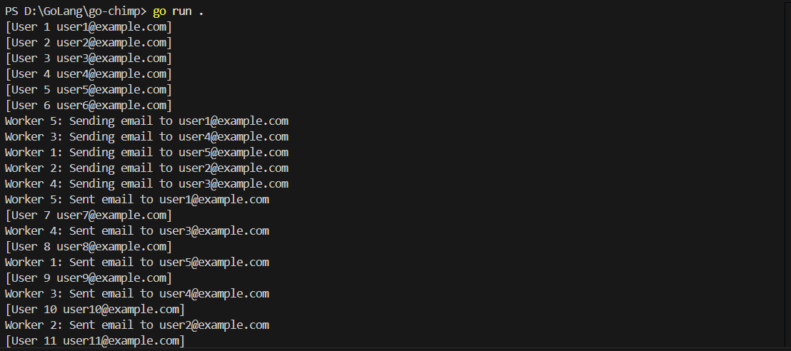
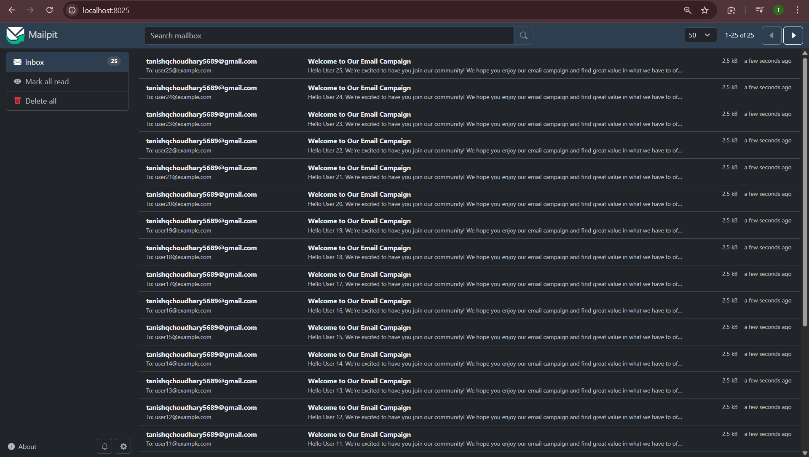
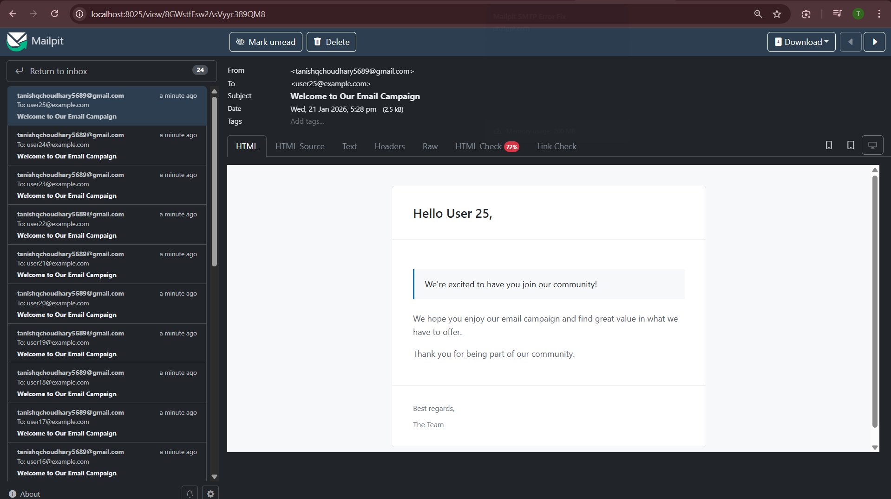

# 🐵 Go-Chimp

A high-performance, concurrent email campaign tool built with Go. Go-Chimp uses worker pools and channels to efficiently send bulk emails with beautiful HTML templates.



## ✨ Features

- **Concurrent Email Processing** - Utilizes Go's goroutines and worker pool pattern for efficient parallel email sending
- **CSV-Based Recipient Management** - Easy bulk email management through CSV files
- **Beautiful HTML Templates** - Professional, responsive email templates with Go's `html/template` engine
- **Robust Error Handling** - Graceful error recovery without stopping the entire campaign
- **SMTP Integration** - Compatible with any SMTP server (tested with MailHog for development)
- **Progress Tracking** - Real-time worker status and email delivery monitoring

## 📋 Prerequisites

- Go 1.25.5 or higher
- An SMTP server (MailHog recommended for testing)

## 🚀 Getting Started

### Installation

1. Clone the repository:
```bash
git clone https://github.com/Tanishq4501/go-chimp.git
cd go-chimp
```

2. Install dependencies:
```bash
go mod download
```

### Setting Up MailHog (for testing)

MailHog is a great tool for testing email sending without actually sending emails:

```bash
# Install MailHog
go install github.com/mailhog/MailHog@latest

# Run MailHog
MailHog
```

MailHog provides:
- **SMTP Server**: `localhost:1025`
- **Web UI**: `http://localhost:8025`



## 📝 Configuration

### 1. Prepare Your Recipients

Edit `emails.csv` with your recipient list:

```csv
Name,Email
John Doe,john@example.com
Jane Smith,jane@example.com
```

### 2. Customize Email Template

Modify `email_template.html` to match your campaign needs. The template supports the following variables:

- `{{.Name}}` - Recipient's name
- `{{.Email}}` - Recipient's email
- `{{.Subject}}` - Email subject
- `{{.Message}}` - Main message content

### 3. Configure SMTP Settings

Update the SMTP settings in `consumer.go`:

```go
smptHost := "localhost"  // Your SMTP host
smptPort := "1025"       // Your SMTP port
```

## 🏃‍♂️ Running the Application

Execute the email campaign:

```bash
go run .
```

You'll see real-time progress as workers send emails:

```
[User 1 user1@example.com]
[User 2 user2@example.com]
Worker 1: Sending email to user1@example.com
Worker 2: Sending email to user2@example.com
Worker 1: Sent email to user1@example.com
Worker 2: Sent email to user2@example.com
```

## 📧 Email Results

View sent emails in MailHog's web interface:



## 🏗️ Project Structure

```
go-chimp/
├── main.go               # Entry point, orchestrates workers and channels
├── producer.go           # Loads recipients from CSV and feeds channel
├── consumer.go           # Worker pool that sends emails
├── email_template.html   # HTML email template
├── emails.csv            # Recipient list
├── go.mod               # Go module definition
└── screenshots/         # Project screenshots
```

## 🔧 How It Works

### Architecture

1. **Producer Pattern**: `producer.go` reads the CSV file and pushes recipients into a channel
2. **Consumer Pattern**: Multiple workers (`consumer.go`) pull from the channel and send emails concurrently
3. **Worker Pool**: Configurable number of concurrent workers (default: 5)
4. **Template Engine**: HTML templates are executed with recipient data for personalized emails

### Key Components

#### Producer (`producer.go`)
```go
func loadRecipient(filePath string, ch chan Recipient) error
```
- Reads CSV file
- Parses recipient data
- Sends recipients to channel
- Closes channel when complete

#### Consumer (`consumer.go`)
```go
func emailWorker(id int, ch chan Recipient, wg *sync.WaitGroup)
func executeTemplate(templatePath string, data EmailData) (string, error)
```
- Workers process recipients from channel
- Execute HTML templates with recipient data
- Send formatted emails via SMTP
- Handle errors gracefully without stopping campaign

#### Main Orchestrator (`main.go`)
- Creates recipient channel
- Spawns producer goroutine
- Creates worker pool with WaitGroup
- Waits for all workers to complete

## ⚙️ Configuration Options

### Adjust Worker Count

In `main.go`, modify the worker count:

```go
workerCount := 5  // Increase for faster processing
```

### Rate Limiting

In `consumer.go`, adjust the delay between emails:

```go
time.Sleep(200 * time.Millisecond)  // Delay before sending
time.Sleep(50 * time.Millisecond)   // Delay after sending
```

## 🔍 Error Handling

The application handles errors gracefully:

- **Template Errors**: Logged and skipped, continues with next email
- **SMTP Errors**: Logged with details, continues with next email
- **CSV Errors**: Returns error and stops (no recipients to process)

## 🎨 Customizing Email Templates

The HTML template supports full styling with inline CSS. Current template features:

- Professional clean design
- Responsive layout (max-width: 600px)
- System font stack for cross-platform compatibility
- Proper email structure (header, content, footer)
- Highlighted message box with accent color

## 🛡️ Best Practices

1. **Test First**: Always test with MailHog before sending real emails
2. **Rate Limiting**: Use appropriate delays to avoid being flagged as spam
3. **Worker Count**: Don't set too high - respect SMTP server limits
4. **Template Testing**: Preview templates with sample data
5. **Error Monitoring**: Check logs for failed emails

## 📊 Performance

- **Concurrent Processing**: 5 workers by default
- **Throughput**: ~20-25 emails per second (with 200ms delays)
- **Scalability**: Easily adjustable worker count based on SMTP limits

## 🤝 Contributing

Contributions are welcome! Please feel free to submit a Pull Request.

## 📄 License

This project is open source and available under the MIT License.

## 👤 Author

**Tanishq**
- GitHub: [@Tanishq4501](https://github.com/Tanishq4501)

## 🙏 Acknowledgments

- Built with Go's powerful concurrency primitives
- Inspired by email marketing platforms like MailChimp
- MailHog for providing an excellent testing SMTP server

---

**Note**: This tool is for legitimate email campaigns only. Always ensure you have permission to email recipients and comply with anti-spam regulations (CAN-SPAM, GDPR, etc.).
